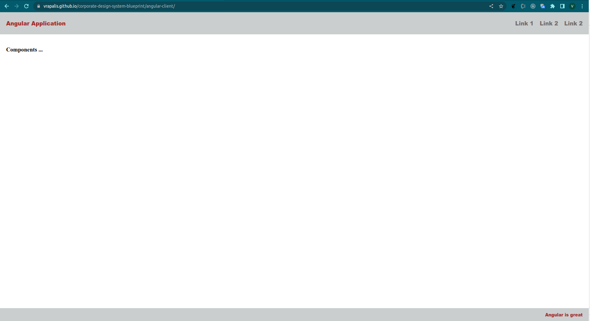
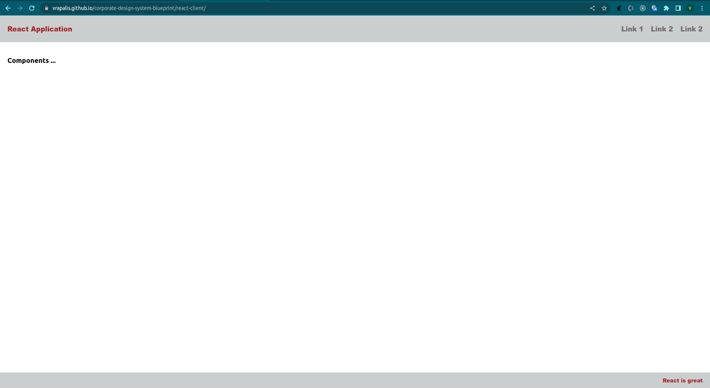
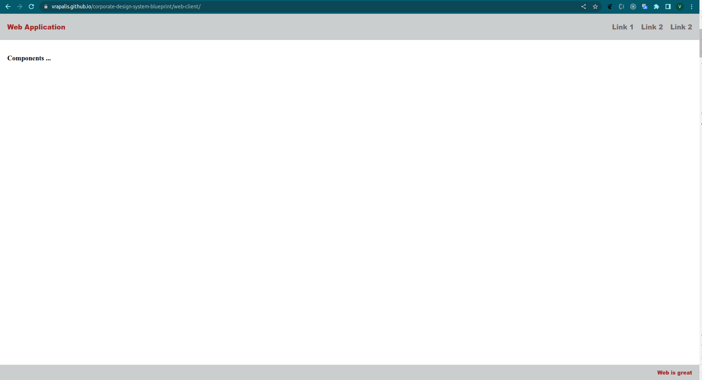

[](https://github.com/commitizen/cz-cli)

[](https://www.npmjs.com/package/@vrapalis/angular-components)
[](https://www.npmjs.com/package/@vrapalis/react-components)
[](https://www.npmjs.com/package/@vrapalis/core-components)

# Corporate Design System Blueprint

---

> Often in a **big companies** different teams use **distinct ui frameworks** to develop frontends, each team has to
> implement buttons, checkboxes and so on over and over again, upon that the team should fallow the styleguide of the company, no surprise this approach is very unsufficient. 
> It exist better approach, to develop **single code basis** and from this code basis then **compile to** target ui framework components **(Angular, React, Vue)**.
> **This project is a blueprint** for developing the **single code basis** (core-components) and from this code basis then to compile
> to target framework components. For this goal [Stencil](https://stenciljs.com/) can be used, stencil is a toolchain for building reusable, 
> design systems. **Stencil** will generate web-components based on web standards and wrap the **web-components** to
> the framework component like angular or react, which can be used als normal framework components.

## Deployed To GitHub Pages 

**Note:** Build and deployed to github pages, 3 clients (Angular, React, Pure Web) for demonstration purpose, all application have same look and feel build and compiled from single source to the target freamework components. Click on the image to navigate to the application.

### Angular Application
[](https://vrapalis.github.io/corporate-design-system-blueprint/angular-client/)

### React Application
[](https://vrapalis.github.io/corporate-design-system-blueprint/react-client/)

### Web Application
[](https://vrapalis.github.io/corporate-design-system-blueprint/web-client/)

## Storybook

**Note:** Storybook is used to document and test in isolation the core components (web-components). Click on the image to navigate to the storybook page.

[](https://vrapalis.github.io/corporate-design-system-blueprint/storybook/)


<details>
  <summary markdown="span">Technology stack used in this project</summary>
    
- [Lerna](https://lerna.js.org/) (Build system for managing and publishing multiple JavaScript/TypeScript packages)
- [Husky](https://github.com/typicode/husky) (Husky improves your commits and more)
- [Commitlint](https://github.com/conventional-changelog/commitlint) (Lint commit messages)
- [Commitizen](https://github.com/commitizen/cz-cli) (When you commit with Commitizen, you'll be prompted to fill out any required commit fields at commit time.)
- [Stencil](https://stenciljs.com) (Stencil is a toolchain for building reusable, scalable Design Systems, based on Web-Components)
- [Angular](https://angular.io) (JS Framework to develop amazing uis)
- [React](https://reactjs.org/) (JS Framework to develop amazing uis)
- [Storybook](rybook.js.org) (Document and test platform)

</details>


## How to use this template for development

### Clone project
```
git clone https://github.com/vrapalis/corporate-design-system-blueprint.git
```

### Install dependencies
```
npm i
```

### Build modules
```
lerna run build --include-dependencies --ignore=angular-client --ignore=react-client --ignore=web-client
```

### Run to test the clients
```
lerna run start --scope=angular-client
lerna run start --scope=react-client
lerna run start --scope=web-client
```

### Run storybook
```
lerna run start --scope=storybook
```

### Commit changes
```
git add .
git cz
```

### Publish packages to npm registry
```
lerna publish
```

### Deploy to GitHub page
```
git checkout ghpage
npm run deploy:ghpage
```