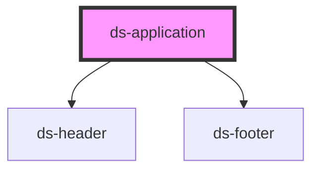

# ds-application

<!-- Auto Generated Below -->

## Properties

| Property      | Attribute      | Description | Type     | Default     |
| ------------- | -------------- | ----------- | -------- | ----------- |
| `footerTitle` | `footer-title` |             | `string` | `undefined` |
| `headerTitle` | `header-title` |             | `string` | `undefined` |

## Dependencies

### Depends on

- [ds-header](../ds-header)
- [ds-footer](../ds-footer)

### Graph

----------------------------------------------

*Built with [StencilJS](https://stenciljs.com/)*
